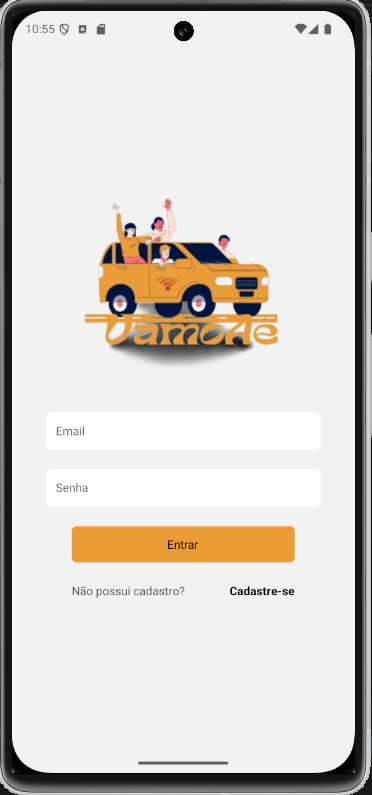
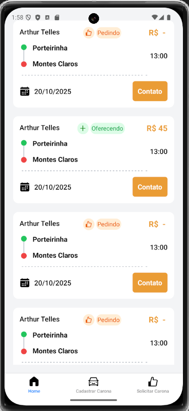

# VamoAê - (Em construção)

Uma solução sustentável para mobilidade urbana colaborativa, aplicativo de Carona Solidária

## Diagrama de entidade relacionamento - DER

## Diagrama caso de uso

## Stack utilizada

**Front-end:** React-Native, Expo, Zod

**Back-end:** Node, Express, PostgreSQL, Prisma ORM

## Telas em desenvolvimento

 
  
  
  
 

